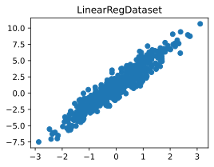
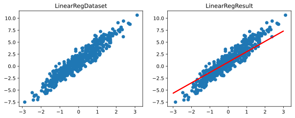

# 线性回归实战


```python
#导入工具包
import torch
from torch import nn
from torch.utils.data import DataLoader
from torch.utils.data import Dataset
from ylml.LossFunction import MSE
from ylml.Optim import SGD,MB_SGD
from ylml.ml import Train,LinearRegression,LinearRegDataset
from ylml.ylnn import LinearRegression_
from ylml.ylnn import Linear
import numpy as np
```

## 构造线性回归数据集并展示


```python
linearRegdataset = LinearRegDataset(500,1,3,1,128)
linearRegdataloader = linearRegdataset.get_dataloader()
linearRegdataset.show_dataset()
```


    

    


## 定义模型损失函数与优化器


```python
#定义设备(CPU，GPU)
device = torch.device(0) if torch.cuda.is_available() else torch.device('cpu')
#定义损失函数MSE(均方差损失)
loss_function = MSE
loss_function_ = nn.MSELoss()
#定义模型
input_num = 1
output_num = 1
model1 = LinearRegression_(input_num,output_num).to(device)
model1_ = LinearRegression_(input_num,output_num).to(device)
model2 = LinearRegression(input_num,output_num)
model2.model.weight.data.normal_(0,1)
model2.model.bias.data.fill_(0)
#定义优化器
optimizer1 = SGD(model1.parameters(),128,0.1)#手动构建的随机梯度下降优化器
optimizer2 = MB_SGD(model1.parameters(),0.0001)#手动构建的小批量随机梯度下降优化器
optimizer3 = torch.optim.SGD(model2.parameters(),0.0001)#torch.optim模块中的SGD
#定义训练器
train = Train(50,loss_function,optimizer1,model1,task_type = 'REG',device = device)
#开始训练
train.start_train(linearRegdataloader)
```

    Start Train!
    Train_set Epoch [0/50] loss: 19.7912654876709
    Train_set Epoch [1/50] loss: 17.523998260498047
    Train_set Epoch [2/50] loss: 17.058345794677734
    Train_set Epoch [3/50] loss: 18.333782196044922
    Train_set Epoch [4/50] loss: 17.02321434020996
    Train_set Epoch [5/50] loss: 17.767698287963867
    Train_set Epoch [6/50] loss: 18.19977378845215
    Train_set Epoch [7/50] loss: 16.264110565185547
    Train_set Epoch [8/50] loss: 14.652688026428223
    Train_set Epoch [9/50] loss: 14.7142333984375
    Train_set Epoch [10/50] loss: 20.428699493408203
    Train_set Epoch [11/50] loss: 18.586057662963867
    Train_set Epoch [12/50] loss: 14.984289169311523
    Train_set Epoch [13/50] loss: 16.603572845458984
    Train_set Epoch [14/50] loss: 16.340717315673828
    Train_set Epoch [15/50] loss: 17.406396865844727
    Train_set Epoch [16/50] loss: 17.038047790527344
    Train_set Epoch [17/50] loss: 12.764969825744629
    Train_set Epoch [18/50] loss: 14.042604446411133
    Train_set Epoch [19/50] loss: 13.982110977172852
    Train_set Epoch [20/50] loss: 10.784822463989258
    Train_set Epoch [21/50] loss: 14.311443328857422
    Train_set Epoch [22/50] loss: 12.60935115814209
    Train_set Epoch [23/50] loss: 15.716523170471191
    Train_set Epoch [24/50] loss: 12.807527542114258
    Train_set Epoch [25/50] loss: 14.644570350646973
    Train_set Epoch [26/50] loss: 12.220856666564941
    Train_set Epoch [27/50] loss: 13.475414276123047
    Train_set Epoch [28/50] loss: 13.736361503601074
    Train_set Epoch [29/50] loss: 13.100719451904297
    Train_set Epoch [30/50] loss: 9.778934478759766
    Train_set Epoch [31/50] loss: 13.734784126281738
    Train_set Epoch [32/50] loss: 11.730583190917969
    Train_set Epoch [33/50] loss: 13.425604820251465
    Train_set Epoch [34/50] loss: 12.522992134094238
    Train_set Epoch [35/50] loss: 11.676433563232422
    Train_set Epoch [36/50] loss: 11.373565673828125
    Train_set Epoch [37/50] loss: 12.533628463745117
    Train_set Epoch [38/50] loss: 12.157657623291016
    Train_set Epoch [39/50] loss: 10.700432777404785
    Train_set Epoch [40/50] loss: 11.866199493408203
    Train_set Epoch [41/50] loss: 10.45802116394043
    Train_set Epoch [42/50] loss: 9.50732135772705
    Train_set Epoch [43/50] loss: 9.286670684814453
    Train_set Epoch [44/50] loss: 10.34372615814209
    Train_set Epoch [45/50] loss: 10.906512260437012
    Train_set Epoch [46/50] loss: 9.004396438598633
    Train_set Epoch [47/50] loss: 10.885324478149414
    Train_set Epoch [48/50] loss: 10.266469955444336
    Train_set Epoch [49/50] loss: 11.078715324401855
    

## 展示训练过程中损失值变化曲线


```python
train.show_loss_value()
```


    

    


## 展示线性回归结果


```python
linearRegdataset.show_result(model1.params)
```


    

    


## 导出模型参数的json文件


```python
model1.get_weight_json()
```

## 指定模型权重参数json文件路径并加载模型权重参数


```python
weight_json_file_path = 'LinearRegression_0.json'
model1_.load_weight_json(weight_json_file_path,device)
print(model1_.params)
```

    [tensor([[0.1032]], requires_grad=True), tensor([[0.2901]], requires_grad=True)]
    


```python
#接着之前训练
optimizer1_ = SGD(model1_.parameters(),128,0.1)#手动构建的随机梯度下降优化器
train_ = Train(200,loss_function,optimizer1_,model1_,task_type = 'REG',device = device)
train_.start_train(linearRegdataloader,2)
```

    Start Train!
    Train_set Epoch [0/200] loss: 10.154094696044922
    Train_set Epoch [1/200] loss: 8.931471824645996
    Train_set Epoch [2/200] loss: 10.440736770629883
    Train_set Epoch [3/200] loss: 9.231822967529297
    Train_set Epoch [4/200] loss: 9.962494850158691
    Train_set Epoch [5/200] loss: 9.794700622558594
    Train_set Epoch [6/200] loss: 8.937064170837402
    Train_set Epoch [7/200] loss: 9.557575225830078
    Train_set Epoch [8/200] loss: 8.085021018981934
    Train_set Epoch [9/200] loss: 10.34006404876709
    Train_set Epoch [10/200] loss: 8.94845199584961
    Train_set Epoch [11/200] loss: 8.417082786560059
    Train_set Epoch [12/200] loss: 8.670568466186523
    Train_set Epoch [13/200] loss: 8.96868896484375
    Train_set Epoch [14/200] loss: 9.801065444946289
    Train_set Epoch [15/200] loss: 7.654609203338623
    Train_set Epoch [16/200] loss: 7.331841468811035
    Train_set Epoch [17/200] loss: 6.51729679107666
    Train_set Epoch [18/200] loss: 7.907822132110596
    Train_set Epoch [19/200] loss: 6.494009017944336
    Train_set Epoch [20/200] loss: 8.982403755187988
    Train_set Epoch [21/200] loss: 6.213624954223633
    Train_set Epoch [22/200] loss: 6.12285041809082
    Train_set Epoch [23/200] loss: 7.218451976776123
    Train_set Epoch [24/200] loss: 8.403434753417969
    Train_set Epoch [25/200] loss: 8.313455581665039
    Train_set Epoch [26/200] loss: 6.8426055908203125
    Train_set Epoch [27/200] loss: 6.941915035247803
    Train_set Epoch [28/200] loss: 7.203344821929932
    Train_set Epoch [29/200] loss: 8.923454284667969
    Train_set Epoch [30/200] loss: 6.97376823425293
    Train_set Epoch [31/200] loss: 6.527912139892578
    Train_set Epoch [32/200] loss: 7.011477947235107
    Train_set Epoch [33/200] loss: 6.326185703277588
    Train_set Epoch [34/200] loss: 6.960962295532227
    Train_set Epoch [35/200] loss: 5.941710948944092
    Train_set Epoch [36/200] loss: 6.093213081359863
    Train_set Epoch [37/200] loss: 6.529021739959717
    Train_set Epoch [38/200] loss: 5.951010704040527
    Train_set Epoch [39/200] loss: 6.606454849243164
    Train_set Epoch [40/200] loss: 6.079417705535889
    Train_set Epoch [41/200] loss: 8.124938011169434
    Train_set Epoch [42/200] loss: 7.407618045806885
    Train_set Epoch [43/200] loss: 5.070266246795654
    Train_set Epoch [44/200] loss: 6.031768798828125
    Train_set Epoch [45/200] loss: 5.382931232452393
    Train_set Epoch [46/200] loss: 5.984421253204346
    Train_set Epoch [47/200] loss: 5.8529887199401855
    Train_set Epoch [48/200] loss: 5.372892379760742
    Train_set Epoch [49/200] loss: 5.417271137237549
    Train_set Epoch [50/200] loss: 6.059230804443359
    Train_set Epoch [51/200] loss: 5.764958381652832
    Train_set Epoch [52/200] loss: 5.672626972198486
    Train_set Epoch [53/200] loss: 4.997081756591797
    Train_set Epoch [54/200] loss: 5.524643898010254
    Train_set Epoch [55/200] loss: 4.427903175354004
    Train_set Epoch [56/200] loss: 6.349259376525879
    Train_set Epoch [57/200] loss: 5.686822414398193
    Train_set Epoch [58/200] loss: 4.825856685638428
    Train_set Epoch [59/200] loss: 5.536790370941162
    Train_set Epoch [60/200] loss: 5.438594818115234
    Train_set Epoch [61/200] loss: 5.9981303215026855
    Train_set Epoch [62/200] loss: 4.696319580078125
    Train_set Epoch [63/200] loss: 3.911027669906616
    Train_set Epoch [64/200] loss: 6.329058647155762
    Train_set Epoch [65/200] loss: 4.673553943634033
    Train_set Epoch [66/200] loss: 5.008455276489258
    Train_set Epoch [67/200] loss: 4.8296403884887695
    Train_set Epoch [68/200] loss: 5.08638858795166
    Train_set Epoch [69/200] loss: 5.103089332580566
    Train_set Epoch [70/200] loss: 4.080297470092773
    Train_set Epoch [71/200] loss: 4.485653400421143
    Train_set Epoch [72/200] loss: 3.975740671157837
    Train_set Epoch [73/200] loss: 5.06263542175293
    Train_set Epoch [74/200] loss: 4.93908166885376
    Train_set Epoch [75/200] loss: 3.3900935649871826
    Train_set Epoch [76/200] loss: 4.767941474914551
    Train_set Epoch [77/200] loss: 4.214285850524902
    Train_set Epoch [78/200] loss: 4.097354412078857
    Train_set Epoch [79/200] loss: 3.677887439727783
    Train_set Epoch [80/200] loss: 4.025371551513672
    Train_set Epoch [81/200] loss: 4.325054168701172
    Train_set Epoch [82/200] loss: 4.145504474639893
    Train_set Epoch [83/200] loss: 3.9354918003082275
    Train_set Epoch [84/200] loss: 3.898897171020508
    Train_set Epoch [85/200] loss: 3.2327775955200195
    Train_set Epoch [86/200] loss: 4.1199517250061035
    Train_set Epoch [87/200] loss: 4.676613807678223
    Train_set Epoch [88/200] loss: 4.4014201164245605
    Train_set Epoch [89/200] loss: 3.804229497909546
    Train_set Epoch [90/200] loss: 4.078866958618164
    Train_set Epoch [91/200] loss: 3.4689011573791504
    Train_set Epoch [92/200] loss: 3.7001376152038574
    Train_set Epoch [93/200] loss: 3.9012815952301025
    Train_set Epoch [94/200] loss: 4.184200763702393
    Train_set Epoch [95/200] loss: 3.0551326274871826
    Train_set Epoch [96/200] loss: 4.146181583404541
    Train_set Epoch [97/200] loss: 3.4930522441864014
    Train_set Epoch [98/200] loss: 3.8648335933685303
    Train_set Epoch [99/200] loss: 3.611950635910034
    Train_set Epoch [100/200] loss: 3.5484604835510254
    Train_set Epoch [101/200] loss: 3.283998966217041
    Train_set Epoch [102/200] loss: 4.021810531616211
    Train_set Epoch [103/200] loss: 3.8074569702148438
    Train_set Epoch [104/200] loss: 3.3941142559051514
    Train_set Epoch [105/200] loss: 3.0918967723846436
    Train_set Epoch [106/200] loss: 2.9505813121795654
    Train_set Epoch [107/200] loss: 3.022611379623413
    Train_set Epoch [108/200] loss: 2.8197340965270996
    Train_set Epoch [109/200] loss: 3.284043073654175
    Train_set Epoch [110/200] loss: 3.098139762878418
    Train_set Epoch [111/200] loss: 3.16904616355896
    Train_set Epoch [112/200] loss: 2.530294895172119
    Train_set Epoch [113/200] loss: 3.7619173526763916
    Train_set Epoch [114/200] loss: 3.7402422428131104
    Train_set Epoch [115/200] loss: 3.11311674118042
    Train_set Epoch [116/200] loss: 2.735725164413452
    Train_set Epoch [117/200] loss: 2.812873363494873
    Train_set Epoch [118/200] loss: 3.237072229385376
    Train_set Epoch [119/200] loss: 2.9564967155456543
    Train_set Epoch [120/200] loss: 3.04793381690979
    Train_set Epoch [121/200] loss: 2.75030517578125
    Train_set Epoch [122/200] loss: 3.459679126739502
    Train_set Epoch [123/200] loss: 2.845094680786133
    Train_set Epoch [124/200] loss: 2.393306255340576
    Train_set Epoch [125/200] loss: 3.0869626998901367
    Train_set Epoch [126/200] loss: 2.4493260383605957
    Train_set Epoch [127/200] loss: 3.4439163208007812
    Train_set Epoch [128/200] loss: 2.846623182296753
    Train_set Epoch [129/200] loss: 2.311846971511841
    Train_set Epoch [130/200] loss: 2.6697609424591064
    Train_set Epoch [131/200] loss: 2.461657762527466
    Train_set Epoch [132/200] loss: 2.6310393810272217
    Train_set Epoch [133/200] loss: 3.2859315872192383
    Train_set Epoch [134/200] loss: 2.578265428543091
    Train_set Epoch [135/200] loss: 2.510753870010376
    Train_set Epoch [136/200] loss: 2.750912666320801
    Train_set Epoch [137/200] loss: 2.153409481048584
    Train_set Epoch [138/200] loss: 2.6135988235473633
    Train_set Epoch [139/200] loss: 2.274022102355957
    Train_set Epoch [140/200] loss: 2.3976593017578125
    Train_set Epoch [141/200] loss: 2.19085955619812
    Train_set Epoch [142/200] loss: 2.3675191402435303
    Train_set Epoch [143/200] loss: 2.351576089859009
    Train_set Epoch [144/200] loss: 2.6455180644989014
    Train_set Epoch [145/200] loss: 2.07627010345459
    Train_set Epoch [146/200] loss: 2.667374610900879
    Train_set Epoch [147/200] loss: 2.0788702964782715
    Train_set Epoch [148/200] loss: 2.0808815956115723
    Train_set Epoch [149/200] loss: 2.2286486625671387
    Train_set Epoch [150/200] loss: 2.725445032119751
    Train_set Epoch [151/200] loss: 2.480194330215454
    Train_set Epoch [152/200] loss: 2.0848634243011475
    Train_set Epoch [153/200] loss: 2.2564663887023926
    Train_set Epoch [154/200] loss: 2.8065240383148193
    Train_set Epoch [155/200] loss: 2.115860939025879
    Train_set Epoch [156/200] loss: 2.134878635406494
    Train_set Epoch [157/200] loss: 2.0277013778686523
    Train_set Epoch [158/200] loss: 2.012603998184204
    Train_set Epoch [159/200] loss: 2.586275100708008
    Train_set Epoch [160/200] loss: 1.8392189741134644
    Train_set Epoch [161/200] loss: 1.6618703603744507
    Train_set Epoch [162/200] loss: 1.968376874923706
    Train_set Epoch [163/200] loss: 2.52777361869812
    Train_set Epoch [164/200] loss: 2.254377841949463
    Train_set Epoch [165/200] loss: 1.8414151668548584
    Train_set Epoch [166/200] loss: 2.0841104984283447
    Train_set Epoch [167/200] loss: 1.6630059480667114
    Train_set Epoch [168/200] loss: 1.6705876588821411
    Train_set Epoch [169/200] loss: 1.9673420190811157
    Train_set Epoch [170/200] loss: 1.478753924369812
    Train_set Epoch [171/200] loss: 2.3372600078582764
    Train_set Epoch [172/200] loss: 1.7679331302642822
    Train_set Epoch [173/200] loss: 2.246502161026001
    Train_set Epoch [174/200] loss: 2.283482074737549
    Train_set Epoch [175/200] loss: 2.203747034072876
    Train_set Epoch [176/200] loss: 2.1200273036956787
    Train_set Epoch [177/200] loss: 2.0706627368927
    Train_set Epoch [178/200] loss: 1.6622045040130615
    Train_set Epoch [179/200] loss: 1.59372079372406
    Train_set Epoch [180/200] loss: 1.6531521081924438
    Train_set Epoch [181/200] loss: 1.650298833847046
    Train_set Epoch [182/200] loss: 1.9617619514465332
    Train_set Epoch [183/200] loss: 1.8642479181289673
    Train_set Epoch [184/200] loss: 1.6014777421951294
    Train_set Epoch [185/200] loss: 2.1069321632385254
    Train_set Epoch [186/200] loss: 1.5697505474090576
    Train_set Epoch [187/200] loss: 1.6964777708053589
    Train_set Epoch [188/200] loss: 1.6642305850982666
    Train_set Epoch [189/200] loss: 1.9304609298706055
    Train_set Epoch [190/200] loss: 1.5808372497558594
    Train_set Epoch [191/200] loss: 1.7402423620224
    Train_set Epoch [192/200] loss: 1.358449101448059
    Train_set Epoch [193/200] loss: 1.9597177505493164
    Train_set Epoch [194/200] loss: 1.7211228609085083
    Train_set Epoch [195/200] loss: 1.3269816637039185
    Train_set Epoch [196/200] loss: 1.9920045137405396
    Train_set Epoch [197/200] loss: 1.7079066038131714
    Train_set Epoch [198/200] loss: 1.7715749740600586
    Train_set Epoch [199/200] loss: 1.919658899307251
    


```python
#展示训练过程中损失值变化曲线
train_.show_loss_value()
```


    

    


```python
#展示线性回归结果
linearRegdataset.show_result(model1_.params)
```


    

    

