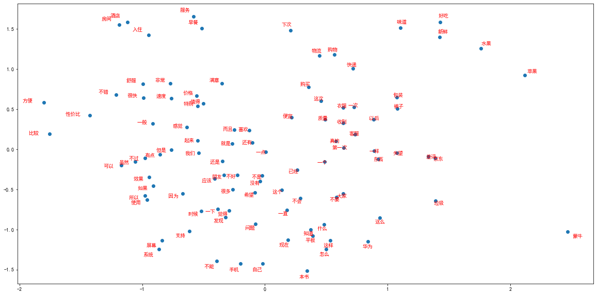

# Word2vec词向量


```python
#导入实验所需的工具包
import re
import jieba
import pandas as pd
from gensim.models.word2vec import LineSentence
from gensim.models import Word2Vec
import gensim
import logging
logging.basicConfig(format='%(asctime)s:%(levelname)s:%(message)s',level=logging.INFO)
```

## 数据预处理


```python
df = pd.read_csv("online_shopping_10_cats.csv")[:60000]
df.head()
```

<table border="1" class="dataframe">
  <thead>
    <tr style="text-align: right;">
      <th></th>
      <th>cat</th>
      <th>label</th>
      <th>review</th>
    </tr>
  </thead>
  <tbody>
    <tr>
      <th>0</th>
      <td>书籍</td>
      <td>1</td>
      <td>做父母一定要有刘墉这样的心态，不断地学习，不断地进步，不断地给自己补充新鲜血液，让自己保持...</td>
    </tr>
    <tr>
      <th>1</th>
      <td>书籍</td>
      <td>1</td>
      <td>作者真有英国人严谨的风格，提出观点、进行论述论证，尽管本人对物理学了解不深，但是仍然能感受到...</td>
    </tr>
    <tr>
      <th>2</th>
      <td>书籍</td>
      <td>1</td>
      <td>作者长篇大论借用详细报告数据处理工作和计算结果支持其新观点。为什么荷兰曾经县有欧洲最高的生产...</td>
    </tr>
    <tr>
      <th>3</th>
      <td>书籍</td>
      <td>1</td>
      <td>作者在战几时之前用了＂拥抱＂令人叫绝．日本如果没有战败，就有会有美军的占领，没胡官僚主义的延...</td>
    </tr>
    <tr>
      <th>4</th>
      <td>书籍</td>
      <td>1</td>
      <td>作者在少年时即喜阅读，能看出他精读了无数经典，因而他有一个庞大的内心世界。他的作品最难能可贵...</td>
    </tr>
  </tbody>
</table>

```python
#使用re正则提取中文并用jieba分词提取词语语料
extract_chinese = re.compile(r'[\u4e00-\u9fa5]+')
chinese_corpus_raw = df['review'].tolist()
chinese_corpus_raw
df['chinese_corpus']=[jieba.lcut("".join(extract_chinese.findall(str(corpus)))) for corpus in chinese_corpus_raw]
df.head()
```

    Building prefix dict from the default dictionary ...
    2022-06-03 15:30:34,023:DEBUG:Building prefix dict from the default dictionary ...
    Loading model from cache C:\Users\23176\AppData\Local\Temp\jieba.cache
    2022-06-03 15:30:34,026:DEBUG:Loading model from cache C:\Users\23176\AppData\Local\Temp\jieba.cache
    Loading model cost 0.609 seconds.
    2022-06-03 15:30:34,635:DEBUG:Loading model cost 0.609 seconds.
    Prefix dict has been built successfully.
    2022-06-03 15:30:34,637:DEBUG:Prefix dict has been built successfully.

<table border="1" class="dataframe">
  <thead>
    <tr style="text-align: right;">
      <th></th>
      <th>cat</th>
      <th>label</th>
      <th>review</th>
      <th>chinese_corpus</th>
    </tr>
  </thead>
  <tbody>
    <tr>
      <th>0</th>
      <td>书籍</td>
      <td>1</td>
      <td>做父母一定要有刘墉这样的心态，不断地学习，不断地进步，不断地给自己补充新鲜血液，让自己保持...</td>
      <td>[做, 父母, 一定, 要, 有, 刘墉, 这样, 的, 心态, 不断, 地, 学习, 不断...</td>
    </tr>
    <tr>
      <th>1</th>
      <td>书籍</td>
      <td>1</td>
      <td>作者真有英国人严谨的风格，提出观点、进行论述论证，尽管本人对物理学了解不深，但是仍然能感受到...</td>
      <td>[作者, 真有, 英国人, 严谨, 的, 风格, 提出, 观点, 进行, 论述, 论证, 尽...</td>
    </tr>
    <tr>
      <th>2</th>
      <td>书籍</td>
      <td>1</td>
      <td>作者长篇大论借用详细报告数据处理工作和计算结果支持其新观点。为什么荷兰曾经县有欧洲最高的生产...</td>
      <td>[作者, 长篇大论, 借用, 详细, 报告, 数据处理, 工作, 和, 计算结果, 支持, ...</td>
    </tr>
    <tr>
      <th>3</th>
      <td>书籍</td>
      <td>1</td>
      <td>作者在战几时之前用了＂拥抱＂令人叫绝．日本如果没有战败，就有会有美军的占领，没胡官僚主义的延...</td>
      <td>[作者, 在, 战, 几时, 之前, 用, 了, 拥抱, 令人, 叫绝, 日本, 如果, 没...</td>
    </tr>
    <tr>
      <th>4</th>
      <td>书籍</td>
      <td>1</td>
      <td>作者在少年时即喜阅读，能看出他精读了无数经典，因而他有一个庞大的内心世界。他的作品最难能可贵...</td>
      <td>[作者, 在, 少年, 时即, 喜, 阅读, 能, 看出, 他, 精读, 了, 无数, 经典...</td>
    </tr>
  </tbody>
</table>

```python
#将每条评论分词后整合到一个列表中，将每个词用空格隔开放入一个列表中
words_list = []
corpus = []
for corpu in df['chinese_corpus'].tolist():
    words_list.append(corpu)
    corpus.append(' '.join(corpu))
words_list[0]
```


    ['做', '父母', '一定', '要', '有', '刘墉', '这样', '的', '心态', '不断', '地', '学习', '不断', '地', '进步', '不断', '地', '给', '自己', '补充', '新鲜血液','让','自己', '保持', '一颗', '年轻', '的', '心', '我', '想', '这', '是', '他', '能','很','好', '的', '和', '孩子', '沟通', '的', '一个', '重要', '因素', '读', '刘墉', '的', '文章', '总能', '让', '我', '看到', '一个', '快乐', '的', '平易近人', '的', '父亲', '他', '始终', '站', '在', '和', '孩子', '同样', '的', '高度', '给', '孩子', '创造', '着', '一个', '充满', '爱', '和', '自由', '的', '生活', '环境', '很', '喜欢', '刘墉', '在', '字里行间', '流露出', '的', '做', '父母', '的', '那种', '小', '狡黠', '让', '人', '总是', '忍俊不禁', '父母', '和', '子女', '之间', '有时候', '也', '是', '一种', '战斗', '武力', '争斗', '过于', '低级', '了', '智力', '较量', '才', '更', '有', '趣味', '所以', '做', '父母', '的', '得', '加把劲', '了', '老', '思想', '老', '观念', '注定', '会', '一败涂地', '生命不息', '学习', '不止', '家庭教育', '真的', '是', '乐在其中']

## skip-gram构建词向量


```python
#skip-gram构建词向量
skip_model = Word2Vec(sentences=words_list,sg=1 ,negative=10,vector_size=500, window=5, min_count=1, workers=4)
skip_model.save("skip.model")
skip_model = Word2Vec.load("skip.model")
```

    2022-06-03 15:30:49,120:INFO:collecting all words and their counts
    2022-06-03 15:30:49,120:INFO:PROGRESS: at sentence #0, processed 0 words, keeping 0 word types
    2022-06-03 15:30:49,177:INFO:PROGRESS: at sentence #10000, processed 379631 words, keeping 29235 word types
    2022-06-03 15:30:49,228:INFO:PROGRESS: at sentence #20000, processed 666652 words, keeping 38407 word types
    2022-06-03 15:30:49,269:INFO:PROGRESS: at sentence #30000, processed 867324 words, keeping 42195 word types
    2022-06-03 15:30:49,302:INFO:PROGRESS: at sentence #40000, processed 1066310 words, keeping 47477 word types
    2022-06-03 15:30:49,342:INFO:PROGRESS: at sentence #50000, processed 1242441 words, keeping 50332 word types
    2022-06-03 15:30:49,430:INFO:collected 63744 word types from a corpus of 1722838 raw words and 60000 sentences
    2022-06-03 15:30:49,431:INFO:Creating a fresh vocabulary
    2022-06-03 15:30:49,650:INFO:Word2Vec lifecycle event {'msg': 'effective_min_count=1 retains 63744 unique words (100.00% of original 63744, drops 0)', 'datetime': '2022-06-03T15:30:49.650694', 'gensim': '4.2.0', 'python': '3.7.1 (default, Dec 10 2018, 22:54:23) [MSC v.1915 64 bit (AMD64)]', 'platform': 'Windows-10-10.0.19041-SP0', 'event': 'prepare_vocab'}
    2022-06-03 15:30:49,651:INFO:Word2Vec lifecycle event {'msg': 'effective_min_count=1 leaves 1722838 word corpus (100.00% of original 1722838, drops 0)', 'datetime': '2022-06-03T15:30:49.651690', 'gensim': '4.2.0', 'python': '3.7.1 (default, Dec 10 2018, 22:54:23) [MSC v.1915 64 bit (AMD64)]', 'platform': 'Windows-10-10.0.19041-SP0', 'event': 'prepare_vocab'}
    2022-06-03 15:30:49,996:INFO:deleting the raw counts dictionary of 63744 items
    2022-06-03 15:30:49,998:INFO:sample=0.001 downsamples 37 most-common words
    2022-06-03 15:30:49,998:INFO:Word2Vec lifecycle event {'msg': 'downsampling leaves estimated 1416646.0217998463 word corpus (82.2%% of prior 1722838)', 'datetime': '2022-06-03T15:30:49.998761', 'gensim': '4.2.0', 'python': '3.7.1 (default, Dec 10 2018, 22:54:23) [MSC v.1915 64 bit (AMD64)]', 'platform': 'Windows-10-10.0.19041-SP0', 'event': 'prepare_vocab'}
    2022-06-03 15:30:50,573:INFO:estimated required memory for 63744 words and 500 dimensions: 286848000 bytes
    2022-06-03 15:30:50,574:INFO:resetting layer weights
    2022-06-03 15:30:50,724:INFO:Word2Vec lifecycle event {'update': False, 'trim_rule': 'None', 'datetime': '2022-06-03T15:30:50.724819', 'gensim': '4.2.0', 'python': '3.7.1 (default, Dec 10 2018, 22:54:23) [MSC v.1915 64 bit (AMD64)]', 'platform': 'Windows-10-10.0.19041-SP0', 'event': 'build_vocab'}
    2022-06-03 15:30:50,724:INFO:Word2Vec lifecycle event {'msg': 'training model with 4 workers on 63744 vocabulary and 500 features, using sg=1 hs=0 sample=0.001 negative=10 window=5 shrink_windows=True', 'datetime': '2022-06-03T15:30:50.724819', 'gensim': '4.2.0', 'python': '3.7.1 (default, Dec 10 2018, 22:54:23) [MSC v.1915 64 bit (AMD64)]', 'platform': 'Windows-10-10.0.19041-SP0', 'event': 'train'}
    2022-06-03 15:30:51,730:INFO:EPOCH 0 - PROGRESS: at 2.04% examples, 98713 words/s, in_qsize 7, out_qsize 0
    2022-06-03 15:30:52,734:INFO:EPOCH 0 - PROGRESS: at 5.22% examples, 98493 words/s, in_qsize 7, out_qsize 0
    2022-06-03 15:30:53,764:INFO:EPOCH 0 - PROGRESS: at 15.88% examples, 99914 words/s, in_qsize 7, out_qsize 0
    2022-06-03 15:30:54,956:INFO:EPOCH 0 - PROGRESS: at 24.49% examples, 103137 words/s, in_qsize 7, out_qsize 0
    2022-06-03 15:30:56,097:INFO:EPOCH 0 - PROGRESS: at 35.18% examples, 105759 words/s, in_qsize 7, out_qsize 0
    2022-06-03 15:30:57,164:INFO:EPOCH 0 - PROGRESS: at 48.13% examples, 108090 words/s, in_qsize 7, out_qsize 0
    2022-06-03 15:30:58,256:INFO:EPOCH 0 - PROGRESS: at 61.37% examples, 109471 words/s, in_qsize 7, out_qsize 0
    2022-06-03 15:30:59,281:INFO:EPOCH 0 - PROGRESS: at 74.55% examples, 109601 words/s, in_qsize 7, out_qsize 0
    2022-06-03 15:31:00,308:INFO:EPOCH 0 - PROGRESS: at 84.09% examples, 107082 words/s, in_qsize 7, out_qsize 0
    2022-06-03 15:31:01,392:INFO:EPOCH 0 - PROGRESS: at 90.77% examples, 108832 words/s, in_qsize 7, out_qsize 0
    2022-06-03 15:31:02,451:INFO:EPOCH 0 - PROGRESS: at 95.40% examples, 110117 words/s, in_qsize 7, out_qsize 0
    2022-06-03 15:31:03,326:INFO:EPOCH 0: training on 1722838 raw words (1416975 effective words) took 12.6s, 112469 effective words/s
    2022-06-03 15:31:04,358:INFO:EPOCH 1 - PROGRESS: at 2.21% examples, 103795 words/s, in_qsize 8, out_qsize 0
    2022-06-03 15:31:05,483:INFO:EPOCH 1 - PROGRESS: at 12.65% examples, 124908 words/s, in_qsize 7, out_qsize 0
    2022-06-03 15:31:06,497:INFO:EPOCH 1 - PROGRESS: at 23.53% examples, 129610 words/s, in_qsize 7, out_qsize 0
    2022-06-03 15:31:07,500:INFO:EPOCH 1 - PROGRESS: at 34.23% examples, 133727 words/s, in_qsize 7, out_qsize 0
    2022-06-03 15:31:08,532:INFO:EPOCH 1 - PROGRESS: at 48.98% examples, 134908 words/s, in_qsize 7, out_qsize 0
    2022-06-03 15:31:09,531:INFO:EPOCH 1 - PROGRESS: at 63.72% examples, 136670 words/s, in_qsize 7, out_qsize 0
    2022-06-03 15:31:10,562:INFO:EPOCH 1 - PROGRESS: at 82.37% examples, 138585 words/s, in_qsize 7, out_qsize 0
    2022-06-03 15:31:11,566:INFO:EPOCH 1 - PROGRESS: at 90.11% examples, 138833 words/s, in_qsize 7, out_qsize 0
    2022-06-03 15:31:12,584:INFO:EPOCH 1 - PROGRESS: at 94.18% examples, 136072 words/s, in_qsize 8, out_qsize 0
    2022-06-03 15:31:13,594:INFO:EPOCH 1 - PROGRESS: at 99.67% examples, 137208 words/s, in_qsize 1, out_qsize 1
    2022-06-03 15:31:13,616:INFO:EPOCH 1: training on 1722838 raw words (1416833 effective words) took 10.3s, 137660 effective words/s
    2022-06-03 15:31:14,645:INFO:EPOCH 2 - PROGRESS: at 2.37% examples, 113315 words/s, in_qsize 7, out_qsize 0
    2022-06-03 15:31:15,741:INFO:EPOCH 2 - PROGRESS: at 12.65% examples, 126957 words/s, in_qsize 7, out_qsize 0
    2022-06-03 15:31:16,815:INFO:EPOCH 2 - PROGRESS: at 23.17% examples, 125665 words/s, in_qsize 6, out_qsize 1
    2022-06-03 15:31:17,900:INFO:EPOCH 2 - PROGRESS: at 30.57% examples, 123362 words/s, in_qsize 7, out_qsize 0
    2022-06-03 15:31:18,914:INFO:EPOCH 2 - PROGRESS: at 42.18% examples, 120834 words/s, in_qsize 7, out_qsize 0
    2022-06-03 15:31:19,917:INFO:EPOCH 2 - PROGRESS: at 57.22% examples, 124466 words/s, in_qsize 7, out_qsize 0
    2022-06-03 15:31:20,938:INFO:EPOCH 2 - PROGRESS: at 73.44% examples, 126804 words/s, in_qsize 7, out_qsize 0
    2022-06-03 15:31:22,085:INFO:EPOCH 2 - PROGRESS: at 87.68% examples, 127113 words/s, in_qsize 7, out_qsize 0
    2022-06-03 15:31:23,101:INFO:EPOCH 2 - PROGRESS: at 92.73% examples, 128511 words/s, in_qsize 7, out_qsize 0
    2022-06-03 15:31:24,128:INFO:EPOCH 2 - PROGRESS: at 97.22% examples, 127708 words/s, in_qsize 7, out_qsize 0
    2022-06-03 15:31:24,637:INFO:EPOCH 2: training on 1722838 raw words (1416495 effective words) took 11.0s, 128630 effective words/s
    2022-06-03 15:31:25,636:INFO:EPOCH 3 - PROGRESS: at 2.21% examples, 106249 words/s, in_qsize 7, out_qsize 0
    2022-06-03 15:31:26,818:INFO:EPOCH 3 - PROGRESS: at 12.65% examples, 124149 words/s, in_qsize 7, out_qsize 0
    2022-06-03 15:31:27,852:INFO:EPOCH 3 - PROGRESS: at 24.13% examples, 133001 words/s, in_qsize 7, out_qsize 0
    2022-06-03 15:31:28,849:INFO:EPOCH 3 - PROGRESS: at 33.31% examples, 130581 words/s, in_qsize 7, out_qsize 0
    2022-06-03 15:31:30,030:INFO:EPOCH 3 - PROGRESS: at 48.13% examples, 128949 words/s, in_qsize 7, out_qsize 0
    2022-06-03 15:31:31,105:INFO:EPOCH 3 - PROGRESS: at 62.03% examples, 128637 words/s, in_qsize 6, out_qsize 1
    2022-06-03 15:31:32,128:INFO:EPOCH 3 - PROGRESS: at 81.77% examples, 132551 words/s, in_qsize 7, out_qsize 0
    2022-06-03 15:31:33,211:INFO:EPOCH 3 - PROGRESS: at 89.58% examples, 131490 words/s, in_qsize 7, out_qsize 0
    2022-06-03 15:31:34,304:INFO:EPOCH 3 - PROGRESS: at 94.18% examples, 130084 words/s, in_qsize 7, out_qsize 0
    2022-06-03 15:31:35,464:INFO:EPOCH 3 - PROGRESS: at 98.99% examples, 128551 words/s, in_qsize 3, out_qsize 1
    2022-06-03 15:31:35,571:INFO:EPOCH 3: training on 1722838 raw words (1416693 effective words) took 10.9s, 129601 effective words/s
    2022-06-03 15:31:36,669:INFO:EPOCH 4 - PROGRESS: at 2.21% examples, 97538 words/s, in_qsize 7, out_qsize 0
    2022-06-03 15:31:37,670:INFO:EPOCH 4 - PROGRESS: at 11.68% examples, 124502 words/s, in_qsize 7, out_qsize 0
    2022-06-03 15:31:38,705:INFO:EPOCH 4 - PROGRESS: at 20.82% examples, 117805 words/s, in_qsize 7, out_qsize 0
    2022-06-03 15:31:39,715:INFO:EPOCH 4 - PROGRESS: at 28.79% examples, 123356 words/s, in_qsize 8, out_qsize 0
    2022-06-03 15:31:40,736:INFO:EPOCH 4 - PROGRESS: at 44.65% examples, 128453 words/s, in_qsize 7, out_qsize 0
    2022-06-03 15:31:41,787:INFO:EPOCH 4 - PROGRESS: at 60.53% examples, 131224 words/s, in_qsize 7, out_qsize 0
    2022-06-03 15:31:42,824:INFO:EPOCH 4 - PROGRESS: at 76.83% examples, 131476 words/s, in_qsize 7, out_qsize 0
    2022-06-03 15:31:43,873:INFO:EPOCH 4 - PROGRESS: at 88.39% examples, 131835 words/s, in_qsize 7, out_qsize 0
    2022-06-03 15:31:44,937:INFO:EPOCH 4 - PROGRESS: at 92.73% examples, 129867 words/s, in_qsize 7, out_qsize 0
    2022-06-03 15:31:45,951:INFO:EPOCH 4 - PROGRESS: at 96.91% examples, 128334 words/s, in_qsize 7, out_qsize 0
    2022-06-03 15:31:46,653:INFO:EPOCH 4: training on 1722838 raw words (1416312 effective words) took 11.1s, 127690 effective words/s
    2022-06-03 15:31:46,653:INFO:Word2Vec lifecycle event {'msg': 'training on 8614190 raw words (7083308 effective words) took 55.9s, 126621 effective words/s', 'datetime': '2022-06-03T15:31:46.653171', 'gensim': '4.2.0', 'python': '3.7.1 (default, Dec 10 2018, 22:54:23) [MSC v.1915 64 bit (AMD64)]', 'platform': 'Windows-10-10.0.19041-SP0', 'event': 'train'}
    2022-06-03 15:31:46,653:INFO:Word2Vec lifecycle event {'params': 'Word2Vec<vocab=63744, vector_size=500, alpha=0.025>', 'datetime': '2022-06-03T15:31:46.653171', 'gensim': '4.2.0', 'python': '3.7.1 (default, Dec 10 2018, 22:54:23) [MSC v.1915 64 bit (AMD64)]', 'platform': 'Windows-10-10.0.19041-SP0', 'event': 'created'}
    2022-06-03 15:31:46,653:INFO:Word2Vec lifecycle event {'fname_or_handle': 'skip.model', 'separately': 'None', 'sep_limit': 10485760, 'ignore': frozenset(), 'datetime': '2022-06-03T15:31:46.653171', 'gensim': '4.2.0', 'python': '3.7.1 (default, Dec 10 2018, 22:54:23) [MSC v.1915 64 bit (AMD64)]', 'platform': 'Windows-10-10.0.19041-SP0', 'event': 'saving'}
    2022-06-03 15:31:46,668:INFO:storing np array 'vectors' to skip.model.wv.vectors.npy
    2022-06-03 15:31:46,797:INFO:storing np array 'syn1neg' to skip.model.syn1neg.npy
    2022-06-03 15:31:46,954:INFO:not storing attribute cum_table
    2022-06-03 15:31:46,984:INFO:saved skip.model
    2022-06-03 15:31:46,984:INFO:loading Word2Vec object from skip.model
    2022-06-03 15:31:46,993:INFO:loading wv recursively from skip.model.wv.* with mmap=None
    2022-06-03 15:31:46,993:INFO:loading vectors from skip.model.wv.vectors.npy with mmap=None
    2022-06-03 15:31:47,043:INFO:loading syn1neg from skip.model.syn1neg.npy with mmap=None
    2022-06-03 15:31:47,090:INFO:setting ignored attribute cum_table to None
    2022-06-03 15:31:47,656:INFO:Word2Vec lifecycle event {'fname': 'skip.model', 'datetime': '2022-06-03T15:31:47.656765', 'gensim': '4.2.0', 'python': '3.7.1 (default, Dec 10 2018, 22:54:23) [MSC v.1915 64 bit (AMD64)]', 'platform': 'Windows-10-10.0.19041-SP0', 'event': 'loaded'}

```python
#查看与给定词相似度最高的10个词
sims = skip_model.wv.most_similar('孩子', topn=10)
sims
```


    [('宝宝', 0.818596601486206),
     ('小孩', 0.8021312355995178),
     ('大人', 0.7726424336433411),
     ('父母', 0.7704293727874756),
     ('儿子', 0.7631828188896179),
     ('小朋友', 0.7627369165420532),
     ('小孩子', 0.755376398563385),
     ('女儿', 0.7456046342849731),
     ('妈妈', 0.7416766881942749),
     ('家长', 0.7315623164176941)]

## 词向量可视化展示


```python
from collections import Counter
#统计词频
words_all_list = []
for word_list in words_list:
    for word in word_list:
        if len(word)!=1:
            words_all_list.append(word)
counter = Counter(words_all_list)
#按照词频降序排列取前100个
words_freq = sorted(list(counter.items()),key = lambda x:x[1],reverse=True)
words_top100=list(dict(words_freq[:100]).keys())
#获得词频前100的词的词向量
vectors_top100 = skip_model.wv[words_top100]
vectors_top100[0]
```


    array([-9.63533472e-04,  3.08847725e-01,  2.17242047e-01, -3.15669551e-02,
           -2.40764618e-01, -2.10673243e-01, -2.87210699e-02,  1.99883744e-01,
            1.15101904e-01,  1.56388119e-01,  4.52579260e-02,  1.94912955e-01,
           -1.04395011e-02, -3.98569852e-02,  9.28105116e-02, -8.20474476e-02,
            6.08142540e-02,  9.85509232e-02, -1.42001584e-01, -1.32267684e-01,
            7.53863901e-02,  9.34082025e-04,  3.84868145e-01,  7.39663467e-02,
            3.69062126e-02, -4.36517671e-02, -1.07947372e-01, -1.15842782e-02,
           -7.91159198e-02, -5.01922928e-02,  1.25287294e-01,  4.58126888e-02,
            5.52382991e-02,  5.05636893e-02,  1.57338724e-01,  3.28775406e-01,
            1.00260787e-01, -9.23958495e-02,  2.21496373e-02, -8.03652927e-02,
            4.12130617e-02,  1.96411274e-02, -3.11306477e-01,  3.50587405e-02,
           -2.39718720e-01,  5.64864650e-02, -7.53426924e-02,  8.76449421e-03,
           -6.42778203e-02,  1.32489577e-01, -1.44223310e-02,  1.07294023e-01,
           -2.49427810e-01, -7.08280429e-02,  1.63544506e-01, -1.14593111e-01,
            3.75115126e-02, -1.44282296e-01,  3.70074391e-01,  8.74571577e-02,
           -1.84445940e-02, -7.38058053e-03,  5.43578938e-02, -1.78246841e-01,
           -1.15735322e-01,  9.05112028e-02, -8.09661075e-02,  1.44248590e-01,
            4.79126573e-01, -1.58096571e-02, -2.98388034e-01,  4.43404689e-02,
            1.40544266e-01, -9.00471061e-02,  2.48599172e-01,  7.14906082e-02,
           -4.17354852e-02, -2.42576119e-03, -1.34913802e-01,  2.50588149e-01,
            8.47489759e-02,  1.24277316e-01, -1.66478619e-01,  1.90430075e-01,
           -3.26547265e-01, -1.30750895e-01, -3.75325233e-01,  2.17706904e-01,
            1.65533468e-01,  1.70147061e-01,  4.40676808e-01, -3.95404585e-02,
           -9.97514129e-02,  2.71925718e-01,  2.51445055e-01,  3.81526686e-02,
            1.24581575e-01, -1.94745868e-01, -5.44428900e-02, -5.50730303e-02,
            1.25785358e-02,  1.03223130e-01, -1.18822269e-01,  1.35678515e-01,
            1.72358053e-03, -4.86526936e-01, -6.20211847e-02,  3.05384696e-01,
           -4.46282662e-02, -1.75632626e-01, -4.20613438e-02, -2.39185184e-01,
           -1.52766645e-01,  3.60308379e-01, -1.13299049e-01,  2.25104317e-02,
            5.78490235e-02, -3.01226258e-01, -2.41130546e-01, -1.11247025e-01,
           -2.39898905e-01, -2.13827014e-01,  3.11226398e-01, -1.50838435e-01,
            1.35734826e-02, -1.88139454e-01, -7.95111805e-02,  1.88522696e-01,
           -9.51852351e-02, -6.70147762e-02, -7.82565624e-02,  9.10647660e-02,
            2.33278617e-01, -2.04126760e-01,  4.92096134e-02,  4.44028646e-01,
           -4.03238577e-04,  4.85573597e-02, -1.31900221e-01, -1.36992261e-01,
           -1.27632394e-01, -3.84243727e-01,  2.56483078e-01, -1.28847420e-01,
            7.71217886e-03, -2.51325995e-01,  1.74660720e-02, -1.30091414e-01,
            2.02567384e-01,  2.10071981e-01, -1.81517042e-02, -9.30557996e-02,
           -1.38646662e-01,  2.48178661e-01, -1.69187501e-01,  6.28788173e-02,
           -7.92461783e-02,  8.74250233e-02,  2.06139818e-01,  1.06840707e-01,
            1.00930683e-01,  2.67948806e-02,  7.83350843e-05, -1.16982453e-01,
            3.12200021e-02,  2.49382198e-01,  3.26478988e-01,  2.19555348e-01,
            2.90227771e-01,  1.23676613e-01,  1.99624762e-01,  1.12572789e-01,
           -1.78802740e-02, -6.21535145e-02, -2.01679826e-01, -1.56450242e-01,
           -8.61681327e-02, -2.29110539e-01,  1.64926182e-02, -1.19870782e-01,
            1.09264879e-02, -8.22980255e-02,  3.94596569e-02, -1.81391332e-02,
           -3.69148888e-02,  1.24983944e-01, -2.89815128e-01,  4.57224958e-02,
           -1.65615946e-01, -2.26884753e-01, -1.31118577e-03, -1.11316405e-01,
            1.53827202e-03, -2.37824157e-01,  3.03724855e-01,  8.23616087e-02,
            1.38183370e-01, -3.53950895e-02, -1.77392066e-01,  1.95380703e-01,
            1.23671085e-01, -1.97668582e-01,  1.43205613e-01,  1.44401088e-01,
           -9.43894237e-02, -3.00897032e-01,  2.17143923e-01,  6.99643511e-03,
           -2.46448755e-01,  2.49717049e-02, -1.69881538e-01,  7.91320503e-02,
           -9.36785638e-02,  1.00973949e-01,  5.57104722e-02, -1.52233928e-01,
            1.44963577e-01, -1.06564492e-01, -2.03156441e-01, -2.84249604e-01,
            1.12291723e-01,  2.97610551e-01, -3.61735038e-02, -5.52883707e-02,
           -1.76749587e-01,  1.86243415e-01,  2.13882372e-01,  3.67269777e-02,
           -5.72695583e-03, -1.59551859e-01, -1.71515360e-01,  1.34088844e-01,
           -3.37575264e-02, -2.55551487e-01, -3.37973833e-02,  5.41818328e-02,
            4.87412140e-02, -2.94753730e-01,  6.94584772e-02,  1.95038721e-01,
           -1.84927836e-01, -1.59950405e-01, -1.72871470e-01,  1.84541330e-01,
            8.87318999e-02, -8.90185088e-02, -9.32791755e-02,  1.11945778e-01,
           -2.91399974e-02,  3.59091945e-02,  3.90493521e-03, -1.40695438e-01,
           -4.83393334e-02,  7.70339556e-03,  1.39893383e-01,  2.53360659e-01,
            1.54584587e-01,  9.07329768e-02, -2.12329283e-01, -2.81729791e-02,
           -3.47824320e-02,  2.40273803e-01,  5.76109178e-02,  1.74863175e-01,
            2.27286085e-01, -1.82042703e-01,  2.23145962e-01,  7.33001903e-02,
            3.32920137e-03, -1.35308569e-02, -2.08661631e-01, -1.02463529e-01,
            3.05883706e-01, -2.17111096e-01, -4.80381213e-02,  9.02618468e-02,
           -4.05422561e-02, -1.07310049e-01, -3.06792259e-02, -1.10704072e-01,
           -6.01984421e-03,  3.97726268e-01, -2.36757062e-02, -8.39728955e-03,
           -8.26162696e-02, -2.09692404e-01, -1.52991667e-01, -1.11891128e-01,
           -2.20723469e-02,  8.09485912e-02,  5.68784513e-02,  1.37104943e-01,
            2.55482435e-01, -5.72729595e-02,  1.22811519e-01,  4.60769795e-02,
            1.93240449e-01, -1.58832148e-01,  1.13196783e-01, -5.87006509e-02,
           -7.33195767e-02, -5.41095361e-02, -7.41185173e-02,  1.59701407e-01,
            1.19169101e-01, -4.83122356e-02, -1.38819709e-01,  1.17831267e-02,
           -1.47247417e-02, -3.32204342e-01, -3.75291929e-02, -1.06503330e-01,
           -2.04074472e-01,  1.95402399e-01,  1.28342077e-01, -4.78450619e-02,
            3.98391895e-02, -5.60640022e-02,  1.05207369e-01,  4.76243421e-02,
           -8.69002417e-02, -1.20104058e-02,  3.72943908e-01,  3.61267738e-02,
           -2.10191142e-02,  8.28034338e-03, -4.04354751e-01, -8.42141286e-02,
            9.40153897e-02, -2.11663336e-01,  2.16570303e-01,  2.22618319e-02,
            1.84428468e-01,  3.31443310e-01, -2.30157562e-02, -7.47272819e-02,
           -4.32915092e-02,  4.34026495e-02, -4.30421196e-02,  6.50225133e-02,
           -2.21763819e-01,  1.17551535e-02,  1.30423963e-01, -1.62094221e-01,
            8.10103193e-02, -7.89554864e-02, -2.78814971e-01, -1.22547068e-01,
           -1.72131315e-01, -1.19964574e-02,  1.56525269e-01, -8.81797224e-02,
           -9.06690732e-02,  1.44848973e-01, -1.59588680e-01,  3.82124513e-01,
           -2.99616214e-02, -1.06060319e-01, -4.68059853e-02,  1.00538902e-01,
           -1.96143940e-01, -2.57147988e-03,  2.85546705e-02, -1.32562965e-01,
            1.57800809e-01,  6.25047982e-02, -1.04844928e-01, -7.07512274e-02,
           -6.51735887e-02,  1.22558951e-01,  1.51592895e-01, -1.75687835e-01,
           -1.70311406e-01, -8.88331532e-02,  4.05488312e-02, -8.85946527e-02,
            3.36153246e-02,  8.34866390e-02,  6.09148629e-02, -4.96437922e-02,
            6.39698468e-03,  2.37188756e-01,  2.50808269e-01,  2.32769236e-01,
            1.01647578e-01,  1.80575117e-01,  1.22326076e-01,  3.43132287e-01,
            2.01948568e-01, -4.37536556e-03, -8.71174037e-02, -2.35344380e-01,
            1.59747317e-01,  2.00125515e-01, -7.95198157e-02,  9.01112780e-02,
            3.86804789e-01,  1.39589041e-01, -1.95358962e-01,  2.13746980e-01,
            4.21794690e-02,  1.51300402e-02, -7.24935755e-02,  5.25811873e-02,
           -3.72414812e-02, -8.45175534e-02,  8.71805921e-02, -9.75569412e-02,
            5.97641170e-02, -1.13735855e-01,  3.17067094e-02,  6.07526908e-03,
           -1.10841356e-01, -1.72992200e-01, -8.33287910e-02,  2.68080771e-01,
            1.62175328e-01, -9.21166539e-02, -2.89644189e-02, -3.19931209e-01,
            1.78295262e-02,  3.01076353e-01, -1.33415004e-02,  9.58459005e-02,
           -9.00510252e-02, -2.02630777e-02,  1.91566814e-02, -2.61331022e-01,
            1.04995117e-01, -1.08470330e-02, -1.68749064e-01,  2.18707904e-01,
            1.13371328e-01, -2.34903693e-01,  7.42840907e-03,  3.27597201e-01,
           -1.41648591e-01, -1.44692793e-01, -2.35248521e-01,  6.61261827e-02,
            1.18191116e-01,  1.53409854e-01,  1.10230453e-01,  2.13079840e-01,
            1.83825836e-01,  1.49676055e-01,  9.92284864e-02,  1.46264613e-01,
           -2.56465971e-01,  6.86970502e-02,  1.74968541e-01, -1.36391837e-02,
            8.23791251e-02, -8.50738510e-02,  9.54819396e-02, -2.37077162e-01,
           -1.38197899e-01,  2.64957696e-01, -4.21267888e-03, -1.17488310e-01,
            7.44151250e-02,  7.66982734e-02, -2.58275926e-01, -8.92344192e-02,
            4.59244959e-02, -2.94674579e-02,  1.07962832e-01, -4.14171778e-02,
           -2.23183140e-01,  3.51369172e-01,  7.35059455e-02, -2.68329740e-01,
            1.70831352e-01,  9.83824357e-02,  4.09850985e-01, -1.42713904e-01,
            3.13165694e-01, -7.09364638e-02, -9.88038555e-02,  8.35667998e-02,
           -1.48825452e-01,  8.76236632e-02,  3.44214402e-02, -1.39229462e-01,
            2.36629676e-02, -2.25980267e-01,  7.52667990e-03,  2.42472246e-01,
           -3.88126262e-02,  1.75876424e-01,  1.26312440e-02,  1.02979526e-01,
            1.37644425e-01, -9.15171020e-03, -9.60571319e-02,  8.11296701e-03,
            1.44635245e-01, -2.52745986e-01,  2.74901073e-02,  3.06850046e-01],
          dtype=float32)


```python
#使用PCA降维得到2维词向量
from sklearn.decomposition import PCA
pca = PCA(n_components=2)
word_2d = pca.fit_transform(vectors_top100)
#词向量可视化展示
import matplotlib.pyplot as plt
plt.rcParams['font.sans-serif']=['SimHei'] #图中文字体设置为黑体
plt.rcParams['axes.unicode_minus']=False #负值显示
plt.figure(figsize=(20,10))
plt.scatter(word_2d[:,0],word_2d[:,1])
for i in range(word_2d.shape[0]):
    plt.text(word_2d[i,0]*1.05, word_2d[i,1]*1.05, words_top100[i], fontsize=10, color = "r",  weight = "light", verticalalignment='center', horizontalalignment='right',rotation=0) #给散点加标签
plt.savefig('word_plot.png', dpi=300, bbox_inches='tight')
```


​    

​    

